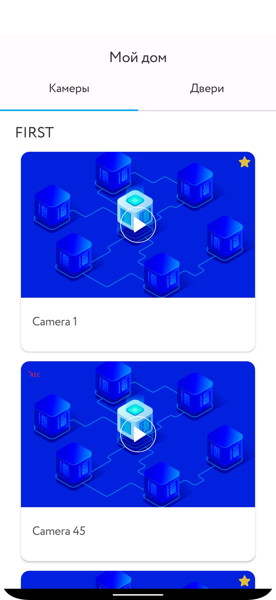
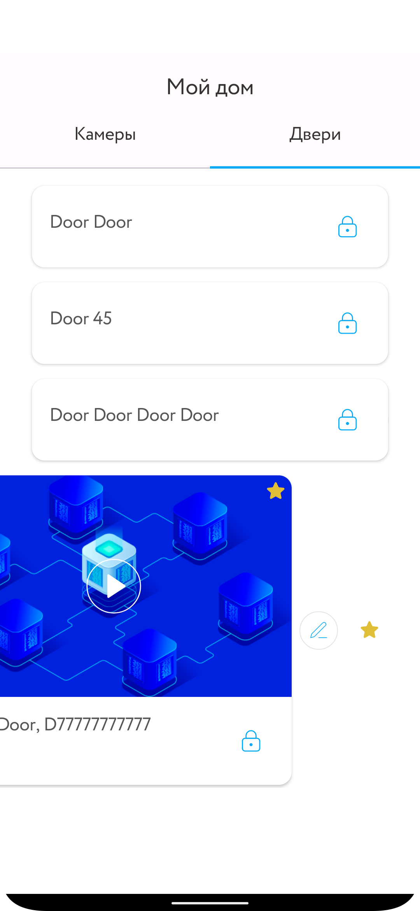
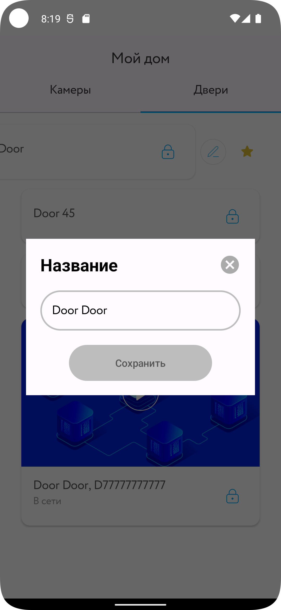
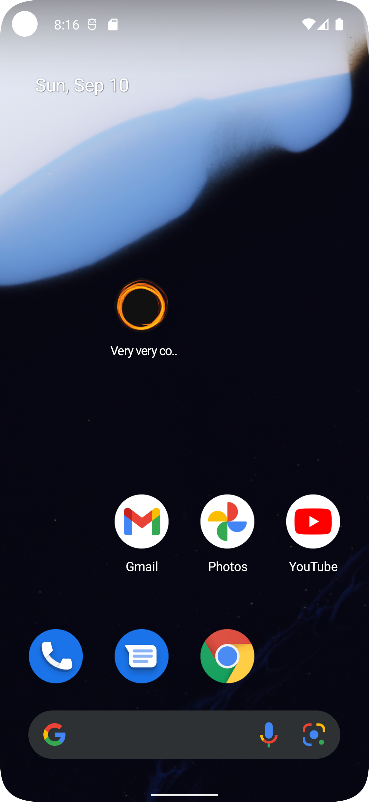

# Very very cool camviewer

Сделано по не очень детализированному ТЗ, поэтому имеется ряд архитектурных и UI/UX изьянов:

1.	Realm – имеет классную фичу – live-объекты, которые отлично ложатся на MVC, но плохо стыкуются с MVVM и корутинами, а разделение программы на компоненты с абстракциями не переживают вовсе
2.	Две кодовые базы на 2 очень похожих Compose-экрана – это плохо, но т.к. нет возможности как-то детализировать и согласовать требования по UI, пришлось оставить
3.	Изменение закэшированных remote-данных должно иметь логику отработки ситуаций, когда remote-source не принял наши пользовательские правки. А наше remote-API не умеет принимать клиентские данные
4.	UI «скупой» - по хорошему, нужно как-то развлекать пользователя, пока происходит фоновая скукотень (например, мерцание карточки, пока грузится картинка с интернета). А т.к. в требованиях нет всего этого и совершенствованию нет предела – оставил почти как есть. Лучше такой результат, чем вообще никакой 😊
5.	Тут ванильный Dagger, не Hilt.
      p.s. Хотел повыпендриваться, но Dagger быстро поставил меня место и заставил доесть кактус)

         

         
